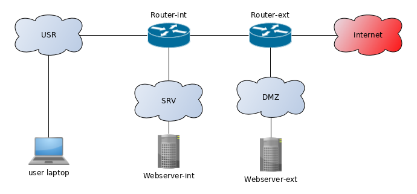

# 1. Fontys week 

This was homework. Please compare with your classmates, and compile a list of questions and/or comments about the HLD

1. Use your updated HLD along with the old LLD to create an updated LLD
    * is rack layout relevant?
    * is a floor plan relevant?

# 2. HLD of office network

This was homework. Please compare with your classmates, and compile a list of questions and/or comments
 LLD is not relevant here, since it will include too much guesswork

# 3. Rack layout

We have multiple racks in juniper lab. 

1. Pick a rack
2. Make a rack layout describing it

# 4. HLD and LLD

Given this diagram, create a proper L3 diagram along with both a HLD and a LLD.

Notes:
* State any assumptions, like IP address ranges
* We use OSPF
* Router_ext is doing NAT'ing
* All devices are virtual in vmware workstation and running on a single host.
* Routers are vSRXs and servers are Debian webservers
